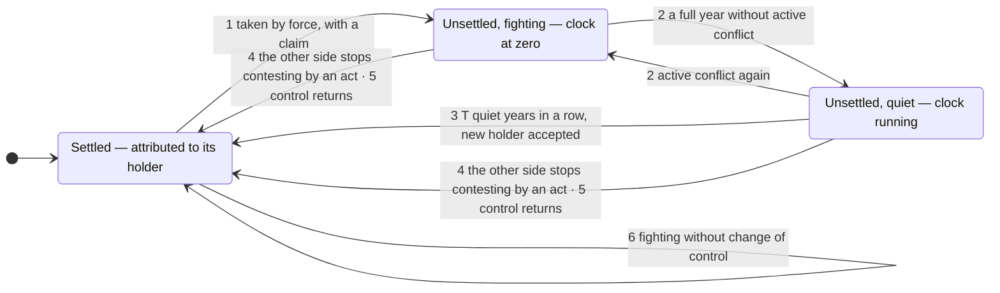

# Unsettled areas and the settling time — proposal

**Status: proposal, not adopted.** Issue: [#20](https://github.com/uncovering-world/travel-regions-extraction/issues/20). Evidence: [settling-rule back-test](../../experiments/settling-rule/README.md), [control-duration experiment](../../experiments/control-duration/README.md), [literature note](../research/2026-10-03-settling-time-literature.md).

## Question

A contested area goes with whoever administers it (agreed in principle on 2026-10-03, see [status](../status.md)). Control can change by force, and such a change can be gone within months. When does the canon follow a forcible change of control, and what does it say in the meantime?

The owner proposed a separate status for territories in flux, reviewed after a waiting time, and asked for a basis for that time stronger than another list's practice.

## Proposal

**Principle.** The canon follows a forcible change of control when the side that lost the area has stopped trying to get it back. Two things show that: an act of that side, or time. The rule is the same in every direction and has no notion of an original or rightful holder: who held an area first is often disputed, and some conflicts run for decades with long pauses (owner, 2026-10-03).

### When the rule applies

All three must hold; otherwise the canon does not change.

1. **Force.** Another party takes control of the area without the consent of the party the canon attributes it to. A transfer the parties agree on is not held back (path 4 below).
2. **A claim.** The new holder asserts the area as its own or as a separate entity. A raid, an intervention or an occupation that makes no such claim changes nothing: the parts of Russia's border oblasts held by Ukrainian forces are in Wikipedia's list of military occupations (2023–2025) and do not appear among the conquest attempts of the Modern Conquest data, which run to 2024 and require an intention of lasting control.
3. **A stated outline.** Any boundary involved is a line the parties themselves state (claim, ceasefire, treaty line). A front line is never drawn.

### States

| State | The canon attributes the area to | A release says |
|---|---|---|
| **Settled** | its holder | nothing, or "also claimed by X" |
| **Unsettled, fighting** | the last settled holder | "unsettled since Y, held by H"; active conflict |
| **Unsettled, quiet** | the last settled holder | "unsettled since Y, held by H, n of T quiet years" |

"Active conflict" is a flag of its own: it is shown in any state while the conflict over the area has a conflict-year in the UCDP/PRIO Armed Conflict Dataset (25 or more battle-related deaths).

### Paths

Years are from the Modern Conquest dataset, Florea's table of de facto states and UCDP, the Nagorno-Karabakh passage from the register; acceptance years are for T = 3.

| | Path | Condition | Effect on the canon | Examples |
|---|---|---|---|---|
| 1 | Seizure | The three conditions above | Attribution unchanged; the area is marked unsettled | Crimea 2014; Northern Cyprus 1974 |
| 2 | Clock | Each full calendar year after the seizure adds one if quiet and resets the clock if not | None | Western Sahara: fighting 1975–1989, clock from 1990; Nagorno-Karabakh: two quiet years, then reset in 1997–98 |
| 3 | Acceptance by time | T quiet years in a row, the holder running a standing civil arrangement. The other side may still claim the area; it has not fought for it for T years | Attribution moves to the holder; the other side stays as claimant | Northern Cyprus 1977; Western Sahara 1992; Crimea 2017 |
| 4 | Acceptance by an act | The other side stops contesting by an act: it agrees to the change, accepts a ruling, gives up its claim, or ceases to exist. A dated, sourced fact | Taken over at the next release, without waiting | Bakassi 2008 (ICJ); Hanish Islands 1998 (arbitration); Sinai by 1982; Nagorno-Karabakh after the 2023 offensive ("The dispute ended after the dissolution of Artsakh") |
| 5 | Return | Control goes back to the party the canon attributes the area to | None: the canon never changed | Kuwait 1990–91; Falkland Islands 1982; 33 of 78 seizures since 1946 ended in the year of the seizure or the next |
| 6 | Fighting without change of control | Active conflict, same holder | Flag only | Golan Heights 1973 and 2025; Kashmir |

A party that retakes an area the canon had attributed to someone else is a new holder like any other: the area is unsettled until the other side stops contesting by an act, or T quiet years pass. Thule Island: accepted as held by Argentina in 1979, retaken by British troops in 1982, and by the same rule accepted as held by the United Kingdom in 1985, after three quiet years.

An earlier draft took a retaking by the "original holder" over at once. The owner rejected that basis: Nagorno-Karabakh needs no waiting because the other side stopped trying, not because its first holder came back.

**First release.** The attribution of each contested area is found by applying the rule to its record: the holder whose control the other side last stopped contesting. Only the last settled holder is needed, never the first.

### What the register has to hold

For each area in the [register](../../data/disputed-areas/README.md), as sourced facts: who holds it and since when; what the holder asserts; any act by which a party stopped contesting (agreement, accepted ruling, renunciation, dissolution), with its date; the UCDP conflicts that are about it; any line the parties state. The status, the clock and the attribution are computed. A new UCDP release is the yearly trigger: an area whose conflict became active is re-checked against sources.

The link from areas to conflict records is a maintained input. Without it, the clock accepts entities that were at war: in the back-test it changes the outcome for 25 of 40 breakaway entities at T = 2.

## The waiting time T

T counts full calendar years after the year of the seizure, so the holder has held the area for between T and T+1 years at acceptance.

Back-test on 78 seizures by states (1946–2024) and 40 breakaway entities (1945–2016):

| T | Changes accepted | of which later undone by force | undone by agreement, ruling or withdrawal | Territory-years spent unsettled |
|---|---|---|---|---|
| 1 | 77 | 6 | 12 | 323 |
| 2 | 71 | 4 | 11 | 435 |
| 3 | 64 | 2 | 9 | 568 |
| 5 | 55 | 2 | 7 | 730 |
| 10 | 43 | 1 | 4 | 1,079 |

Not counted as undone: entities that became states and one island that sank.

- **The step from 2 to 3 is the last that removes reversals by force**: Buraimi (accepted 1954, retaken 1955) and Chechnya (accepted 1993, reintegrated 1999). From 3 on, the same two accepted changes were undone by force (Thule Island, Anjouan).
- **Beyond 3, waiting removes only changes that ended by agreement**, at a growing cost: at T = 5 two more (East Timor, Gagauzia), with every accepted change unsettled two years longer; at T = 10 Crimea and Siachen are still unsettled and Nagorno-Karabakh is never accepted in thirty-two years.
- **The picture at the end of 2024 is the same for T = 1, 2 and 3**; T = 5 differs by two border areas taken in 2020.
- **Published work points the same way.** Altman (2020, p. 502): "conquest attempts tend to either fail quickly or succeed"; of 34 held when the immediate conflict subsided, five were lost ten years later. Two years is the convention for counting a de facto state (Kolstø 2006: "to eliminate a whole spate of ephemeral political contraptions"; Florea: 24 months). Five years is Roberts's threshold for a "prolonged occupation"; Koutroulis (2012, p. 168) notes that any such definition "will essentially be arbitrary".
- **Limits.** Each step rests on two to four cases; the data have year precision; each population comes from one author's dataset. The record separates 1 from 3 and 3 from 10 clearly, 2 from 3 only weakly.

**Recommendation: T = 3.** Two is defensible (it is the literature's convention and the owner's first suggestion) at the price of the two reversals above. Five and ten are not supported over three.

**Decided by the owner on 2026-10-03: T = 3; no original holder; only an explicit act ends a contest at once; the status creates no regions.** To be recorded in the spec with the rest of the rule once its open points are settled.

## How it would have run

Year in which the canon accepts the new holder, by T; "—" means never. From `outputs/showcase.csv` of the back-test.

| Area | Taken | T=1 | T=2 | T=3 | T=5 | T=10 | Ended |
|---|---|---|---|---|---|---|---|
| Kuwait | 1990 | — | — | — | — | — | 1991, by force |
| Falkland Islands | 1982 | — | — | — | — | — | 1982, by force |
| Hanish Islands | 1995 | 1996 | 1997 | — | — | — | 1998, by arbitration |
| Sinai and Gaza | 1967 | 1968 | 1972 | 1976 | 1978 | — | 1982, by agreement |
| East Timor | 1975 | 1989 | 1990 | 1991 | — | — | 1999, by withdrawal |
| Bakassi | 1993 | 1994 | 1995 | 1999 | 2001 | 2006 | 2008, by ruling |
| Goa | 1961 | 1962 | 1963 | 1964 | 1966 | 1971 | held |
| Golan Heights | 1967 | 1968 | 1969 | 1970 | 1972 | 1983 | held |
| Northern Cyprus | 1974 | 1975 | 1976 | 1977 | 1979 | 1984 | held |
| Western Sahara | 1975 | 1990 | 1991 | 1992 | 1994 | 1999 | held |
| Siachen | 1984 | 1985 | 1986 | 2006 | 2008 | — | held |
| Hala'ib Triangle | 1995 | 1996 | 1997 | 1998 | 2000 | 2005 | held |
| Crimea | 2014 | 2015 | 2016 | 2017 | 2019 | — | held |
| Doumeira | 2017 | 2018 | 2019 | 2020 | 2022 | — | held |
| Ladakh (part) | 2020 | 2021 | 2022 | 2023 | — | — | held |
| al-Fashaga | 2020 | 2021 | 2022 | 2023 | — | — | held |
| Chechnya | 1991 | 1992 | 1993 | — | — | — | 1999, by force |
| Tamil Eelam | 1984 | 2002 | — | — | — | — | 2009, by force |
| Krajina | 1991 | — | — | — | — | — | 1995, by force |
| Gagauzia | 1991 | 1992 | 1993 | 1994 | — | — | 1995, by agreement |
| Anjouan | 1997 | 1998 | 1999 | 2000 | 2002 | 2007 | 2008, by force |
| Transnistria | 1991 | 1993 | 1994 | 1995 | 1997 | 2002 | alive in 2016 |
| Abkhazia | 1991 | 1994 | 1995 | 1996 | 1998 | 2003 | alive in 2016 |
| Nagorno-Karabakh | 1991 | 1995 | 1996 | 2001 | 2003 | — | alive in 2016; retaken 2020–2023 |
| Somaliland | 1991 | 1992 | 1993 | 1994 | 1996 | 2001 | alive in 2016 |
| Donetsk | 2014 | — | — | — | — | — | alive in 2016 |

The back-test does not model the requirement of a standing civil arrangement, which could only delay these years, and it treats the conquest dataset's definition as the claim condition. Sinai is in that dataset as a conquest attempt; whether Israel asserted it as its own is not checked here.

## Open points

To be put to the owner one at a time:

1. ~~The value of T.~~ Decided: three years.
2. ~~Path 4: which acts count as the other side having stopped contesting.~~ Decided: only an explicit act — agreement, accepted ruling, renunciation of the claim, or the party ceasing to exist. A claim kept on paper by a party that can no longer act waits for the clock, because "cannot act" would be a judgement of ours and an act has a date and a document.
3. ~~Whether the status can create a region.~~ Decided: no new rule. A region exists through the reference registry (a supported point of view separates the area) or through CR-W (R044): where another party controls civilian access, the entry decision for the area differs from the rest of the region, which CR-W separates once a witness is cited and its gates pass. Until then an unsettled area stays inside the region of the party it is attributed to, with the status shown. Acceptance separates it at the latest, because it then has another country than the rest of the region; a strip between two neighbours moves into the neighbour's region instead. The status decides only to whom a region is attributed.
4. What counts as evidence of a standing civil arrangement.
5. The release interval; one release per year is assumed here.

## What adoption would change

New R items for the status, the clock and the paths, with a D entry; Q007 narrows further and Q008 gains the status as its answer for contested control; the register gains the fields above and the link to UCDP; the [release stability proposal](release-stability.md) keeps its options for changes nobody contests, such as visa regimes.
